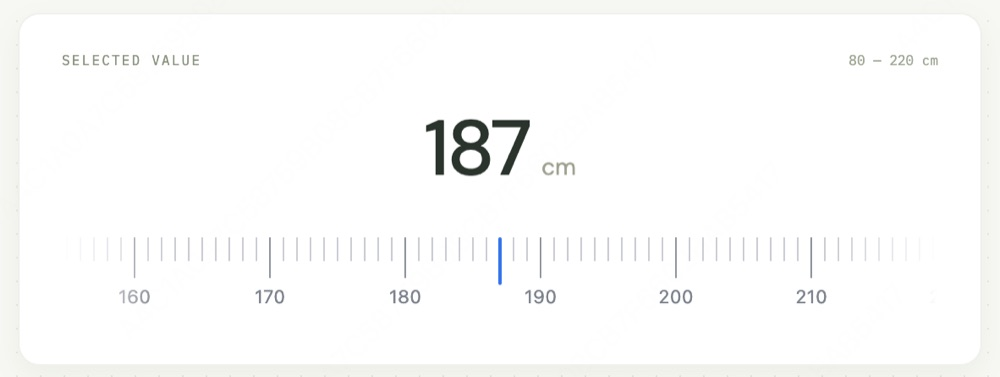

# react-ruler-picker

[English](README.en.md) | 简体中文

React + TypeScript 数值标尺选择器组件。支持横向与纵向刻度尺、整数或小数步长、指针与触摸滚动、键盘输入、受控数值，以及 Canvas 渲染的刻度。

[](LICENSE)
[](https://www.npmjs.com/package/react-ruler-picker)
[](https://www.npmjs.com/package/react-ruler-picker)

[在线演示](https://react-ruler-picker.vercel.app)



- 从可配置的数值范围和步长间隔中选择数值。
- 支持横向、纵向以及反向标尺刻度。
- 支持指针、鼠标滚轮、触摸惯性滚动和键盘输入。
- 可自定义刻度、刻度标签、选中数值展示和中心指针。
- 支持受控 / 非受控数值，以及命令式 ref 方法。
- 提供 ESM、CommonJS、TypeScript 类型声明，除 React 外无任何运行时依赖。

## 安装

```sh
npm install react-ruler-picker
```

要求 React 16.8 及以上版本。

## 快速上手

```tsx
import { useState } from "react";
import { RulerPicker } from "react-ruler-picker";

export function HeightField() {
  const [value, setValue] = useState(170);

  return (
    <RulerPicker
      min={80}
      max={220}
      value={value}
      onValueChange={setValue}
      aria-label="Height in centimeters"
      formatValue={(next) => `${next} cm`}
    />
  );
}
```

组件首次挂载时会自动注入样式，无需额外引入样式文件。通过 `orientation="vertical"` 获得纵向标尺，通过 ref 调用 `scrollToValue` / `getValue` 进行命令式操作。此外还导出 `clampValueByStep`、`formatValueByStep`、`getStepPrecision` 工具函数。

## Props

| Prop | 类型 | 默认值 / 行为 |
| --- | --- | --- |
| `min`, `max` | `number` | 必填的有限范围边界；传入相反顺序会自动归一化。 |
| `step` | `number` | `1`；最小可选增量。非法或非正值按 `1` 处理。 |
| `value` | `number` | 受控的选中数值。 |
| `defaultValue` | `number` | `min`；非受控时的初始值。 |
| `majorStep` | `number` | `step * 10`；主刻度之间的间隔（以数值为单位）。 |
| `labelStep` | `number` | `majorStep` 或 `step * 10`；设为 `0` 隐藏刻度标签。 |
| `tickSpacing` | `number` | `8`；刻度之间的间距（CSS 像素）；最小为 `1`。 |
| `orientation` | `'horizontal' \| 'vertical'` | `'horizontal'`；标尺方向。 |
| `tickAlignment` | `'top' \| 'bottom' \| 'left' \| 'right'` | `'top'`；刻度基准线的对齐方式。 |
| `reverse` | `boolean` | `false`；反转数值递增的方向。 |
| `height` | `number` | `240`；纵向轨道的高度（CSS 像素）。 |
| `minorTickStyle`, `majorTickStyle` | `TickStyle` | 刻度的 `width`、`height`、`color` 和 `borderRadius`。 |
| `getTickStyle` | `(info: TickInfo) => Partial<TickStyle> \| undefined` | 针对单个刻度的样式回调。 |
| `labelStyle` | `LabelStyle` | 刻度标签的字体样式。 |
| `formatLabel` | `(value: number) => string` | 刻度标签格式化函数。 |
| `cursorStyle` | `CursorStyle` | 中心指针的 `width`、`height`、`color` 和 `borderRadius`。 |
| `renderCursor` | `() => ReactNode` | 自定义中心指针。 |
| `showValue`, `showEdgeMasks` | `boolean` | `true`；分别控制选中数值展示和边缘渐隐遮罩。 |
| `valueStyle` | `CSSProperties` | 数值区域的样式。 |
| `formatValue` | `(value: number) => string` | 格式化选中数值及 `aria-valuetext`。 |
| `renderValue` | `(value: number) => ReactNode` | 自定义选中数值内容。 |
| `platform` | `'auto' \| 'ios' \| 'android' \| 'harmony'` | `'auto'`；Android 和 Harmony 使用惯性滚动采样。 |
| `disabled` | `boolean` | `false`；禁用交互并取消进行中的惯性滚动。 |
| `onScrollStart` | `() => void` | 用户滚动会话开始时调用一次。 |
| `onValueChange` | `(value, meta) => void` | 数值变化时调用。`meta.source` 为 `drag`、`momentum`、`keyboard` 或 `programmatic`。 |
| `onValueChangeEnd` | `(value: number) => void` | 滚动停在某个步长上之后调用一次。 |
| `aria-label` | `string` | 无障碍名称；未提供 `aria-labelledby` 时默认为 `'Value'`。 |
| `aria-labelledby`, `aria-describedby` | `string` | 无障碍标签和描述的元素 ID。 |
| `className`, `style` | `string`, `CSSProperties` | 根容器的 class 和内联样式。 |

## 交互

- 指针、滚轮和触摸惯性均可拖动选择；触摸停止后自动吸附到最近的步长。
- 键盘：方向键移动一个步长，Page Up / Down 移动十个步长，Home / End 选中范围边界。
- 平滑滚动遵循 `prefers-reduced-motion`。

可选数值遵循 `min + n * step`（如 `min=0`、`max=10`、`step=3` 时可选 `0`、`3`、`6`、`9`）。非有限范围边界和超长标尺会抛出 `RangeError`。

## 开发

```sh
npm install
npm run dev      # 启动 Playground 开发服务器
npm test         # 运行测试
npm run check    # 完整校验（类型、测试、构建、打包、体积）
```

## License

[MIT](LICENSE)
